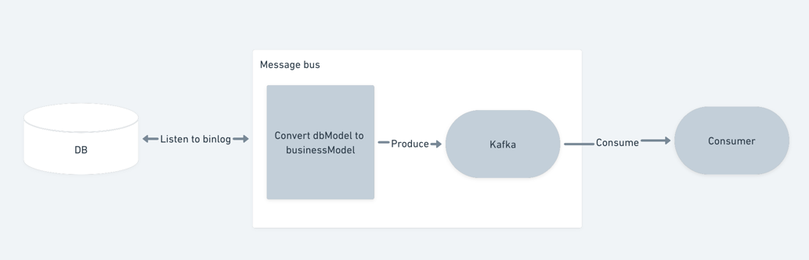

# Change Data Capture (CDC) system prototype

## Main purposes
- Different business teams can listen for data changes in the DB easily by consuming Kafka message
- De-couple between physical database format & business data model. Each team only need to care about their business model & how to consume Kafka message

## Architecture

- *Message bus* will listen to row events from binlog for DB changes
- *Message bus* convert DB data model to business data model; then put the message in to Kafka. The message then will be consumed by 
the Kafka consumer

## Demo
1. Start DB server
2. Start Kafka server
3. Start message bus prototype `go run main.go`
4. Start consumer 
   1. `cd client`
   2. `go run main.go`
5. Create table name `User`. Insert & then update some data. Then, observe result at consumser

## Future improvement
- Use better serialization method instead of JSON, such as proto-buf
- Use Kafka AsyncProducer instead of Sync one for better performance
